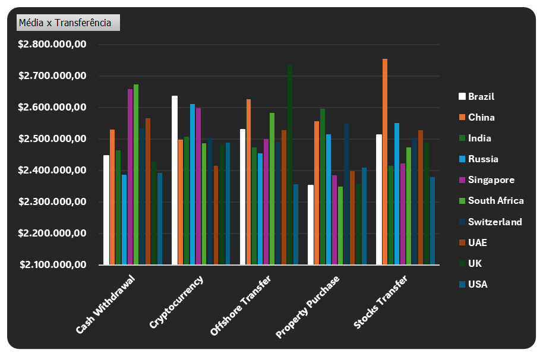
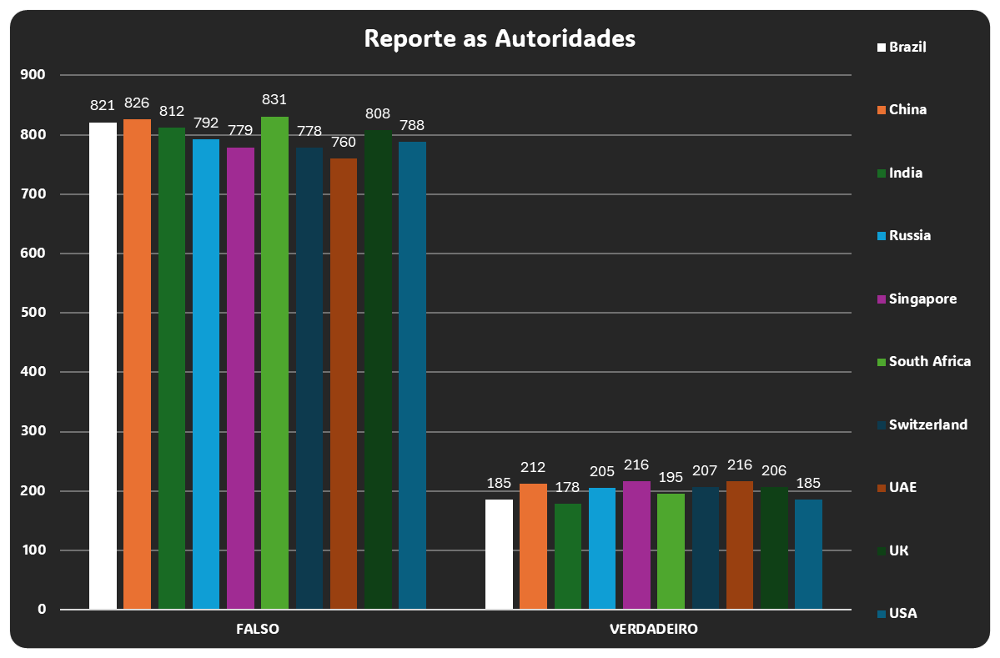
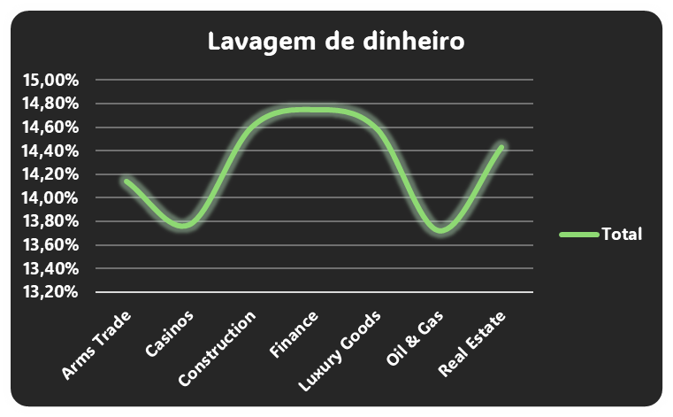
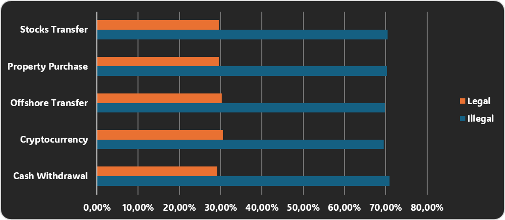
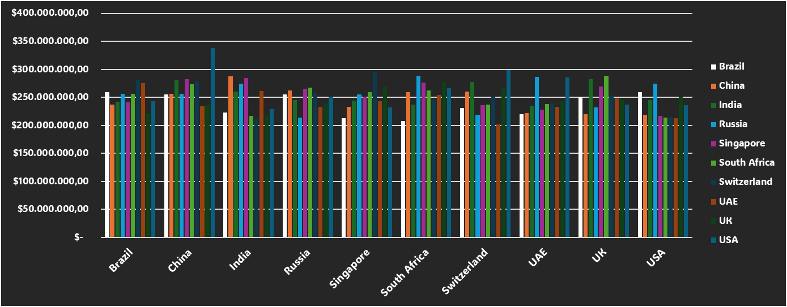
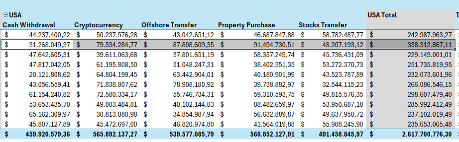

# Análise de Dados de Mercado Negro Global

Este projeto utiliza o conjunto de dados **Global Black Money Transactions Dataset**, disponível no [Kaggle](https://www.kaggle.com/datasets/waqi786/global-black-money-transactions-dataset). Este dataset foi selecionado para realizar uma análise prática com foco no uso do Excel para tratamento e visualização de dados.

## 1. Introdução

Ao importar o arquivo CSV, foi necessário ajustar alguns tipos de dados, como datas e valores monetários, para adequá-los ao padrão brasileiro. Especificamente, como o arquivo está no formato americano, apliquei a localidade dos Estados Unidos para as colunas de data e moeda. Além disso, converti colunas de texto numérico (string) para um formato decimal, facilitando os cálculos.

## 2. Análise de Dados

Para esta análise, criei diversas tabelas dinâmicas, enfatizando aquelas que oferecem insights mais relevantes. Abaixo estão algumas das principais observações obtidas a partir desses dados.

### 2.1. Média por Tipo de Transação e País

A primeira tabela apresenta a média de valores para cada tipo de transação por país:

> Aqui, observamos que certos tipos de transação se destacam mais em alguns países. Por exemplo, no caso do Brasil, o uso de criptomoedas supera significativamente as transações de compra de imóveis, que também poderiam ser utilizadas para lavagem de dinheiro. Esse padrão sugere que as autoridades podem estar monitorando menos as transações em criptomoedas, um ponto a ser investigado mais a fundo.

### 2.2. Transações Reportadas às Autoridades

O gráfico abaixo revela que a grande maioria das transações no dataset não são reportadas às autoridades:

> Essa observação indica uma lacuna significativa em termos de monitoramento, já que muitas operações potencialmente suspeitas permanecem sem supervisão.

### 2.3. Setores e Empresas com Maior Risco de Lavagem de Dinheiro

A partir de outro gráfico, identificamos os setores com maior incidência de lavagem de dinheiro:

> Setores como o financeiro aparecem com destaque, sugerindo áreas onde as autoridades poderiam concentrar esforços para uma investigação mais eficaz. Esse foco setorial poderia otimizar a alocação de recursos de fiscalização.

### 2.4. Taxa de Ilegalidade nas Transações

Ao avaliar a natureza das transações, constatamos que aproximadamente 70% das operações no dataset são ilegais:

> Esse dado reforça a importância de regulamentações e supervisão em transações transnacionais, especialmente em casos de transferência de fundos envolvendo múltiplos países.

### 2.5. Fluxo de Transações entre Países

Analisando as transações de país para país, identificamos um valor expressivo de aproximadamente **350 milhões de dólares** transferidos da China para os Estados Unidos, sendo que o maior valor está associado ao tipo de transação de **Compra de Propriedade**.

> A aquisição de imóveis é uma prática que pode ser utilizada para converter fundos de origem suspeita em ativos legais, configurando-se como uma possível estratégia de lavagem de dinheiro. Isso destaca a importância de uma supervisão mais rígida nas transações imobiliárias transnacionais.

---

Essa análise destaca padrões e anomalias no conjunto de dados, sugerindo áreas onde autoridades e investigadores poderiam concentrar esforços para mitigar atividades de lavagem de dinheiro.
